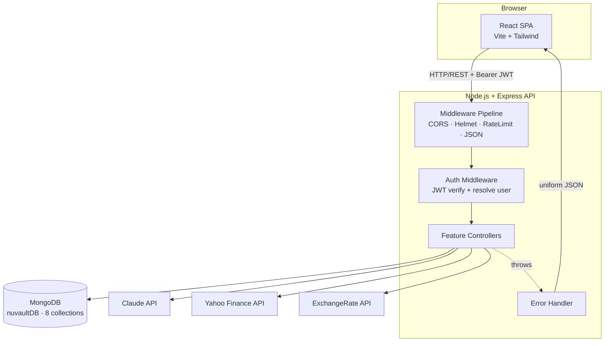
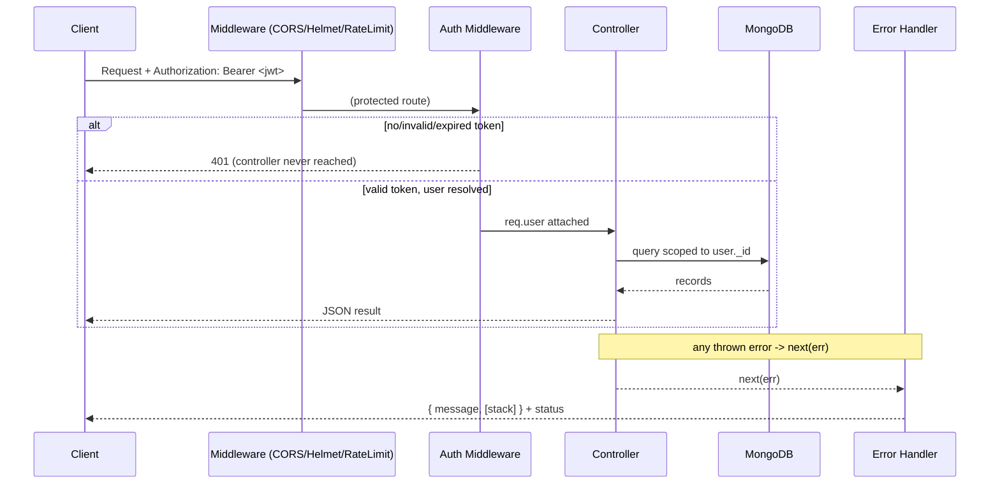
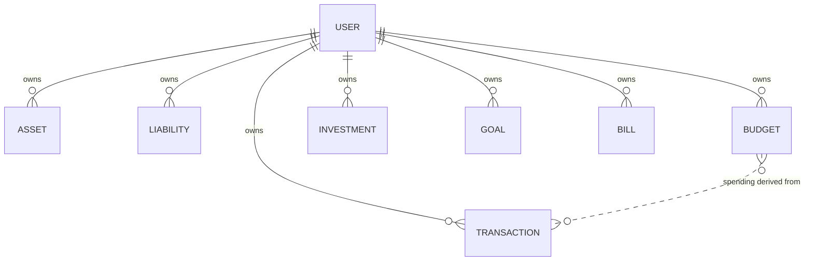

# Design Document

## Overview

Nuvault is a full-stack personal finance application built around a single, non-negotiable invariant: **every piece of financial data belongs to exactly one user, and a user can only ever read or modify their own data.** This per-user isolation rule is enforced uniformly at the controller/query layer rather than relying on convention.

The system has four layers:

- **Client** — A React (Vite + Tailwind) single-page application. It holds the JWT in local storage, attaches it to every protected request, and reacts to `401` responses by clearing the session and redirecting to login.
- **API_Server** — A Node.js + Express REST API. Requests pass through CORS, body parsing, security headers, and rate limiting, then through auth middleware (for protected routes), then into feature controllers, and finally into a uniform error handler.
- **Database** — MongoDB (via Mongoose). Eight collections: `users`, `assets`, `liabilities`, `transactions`, `budgets`, `investments`, `goals`, `bills`. Every non-user document carries a `user` reference.
- **External integrations** — Claude API (AI advice), Yahoo Finance API (live prices), ExchangeRate API (currency conversion). Each is wrapped with a timeout and graceful degradation so an external failure never crashes a request.

Two values are **always computed, never stored**: Net Worth (assets − liabilities) and Budget spending (sum of matching expense transactions). This keeps derived figures consistent with their source data at all times.

This design covers all 22 requirements: authentication and session handling (R1–R4, R21), data isolation (R5), the financial domains (R6–R17), AI advice (R18), multi-currency (R19), and the cross-cutting error handling and security concerns (R20, R22).

### Key Design Decisions

| Decision | Rationale | Requirements |
|----------|-----------|--------------|
| Net Worth and Budget spending computed on each request | Derived values can never drift from source records | R8.4, R12.6 |
| Isolation enforced by injecting `user: req.user._id` into every query/create and ignoring client-supplied `user` | Defense-in-depth against IDOR; a forgotten filter cannot leak data if the pattern is centralized | R5.1–R5.6 |
| Cross-resource "not owned" returns `404`, not `403` | Avoids confirming existence of another user's record | R5.3 |
| External API calls wrapped with timeout + fallback | A slow/broken third party degrades gracefully instead of failing the user request | R14.6, R18.6, R19.3 |
| JWT carries only `user_id`, 30-day expiry, stateless | No server session store; simple horizontal scaling | R2.6 |
| Server-side validation with `express-validator` before any DB write | Single trusted validation boundary; client validation is convenience only | R22.6, R22.7 |
| Passwords hashed with bcrypt (salt) in a Mongoose pre-save hook | Plaintext never persisted; hashing centralized on the model | R1.2 |

## Architecture

### System Context



### Request Lifecycle



### Route Map

All routes are protected except `POST /api/auth/register` and `POST /api/auth/login` (R4.6).

| Domain | Method & Path | Purpose | Requirements |
|--------|---------------|---------|--------------|
| Auth | `POST /api/auth/register` | Create user, return JWT | R1 |
| Auth | `POST /api/auth/login` | Verify credentials, return JWT | R2 |
| Auth | `GET /api/auth/me` | Return current profile | R3 |
| Net Worth | `GET /api/networth` | Computed net worth + lists | R8 |
| Assets | `POST/PUT/DELETE /api/assets[/:id]` | Asset CRUD | R6 |
| Liabilities | `POST/PUT/DELETE /api/liabilities[/:id]` | Liability CRUD | R7 |
| Transactions | `GET/POST/PUT/DELETE /api/transactions[/:id]` | Transaction CRUD + filter | R9, R10 |
| Transactions | `GET /api/transactions/summary` | Category income/expense totals | R10.4 |
| Budgets | `GET/POST/PUT/DELETE /api/budgets[/:id]` | Budget CRUD + spending | R11, R12 |
| Investments | `GET/POST/PUT/DELETE /api/investments[/:id]` | Investment CRUD | R13 |
| Investments | `GET /api/investments/summary` | Live pricing + P&L | R14 |
| Goals | `GET/POST/PUT/DELETE /api/goals[/:id]` | Goal CRUD + progress | R15 |
| Bills | `GET/POST/PUT/DELETE /api/bills[/:id]` | Bill CRUD | R16 |
| Bills | `PATCH /api/bills/:id/pay` | Mark paid + advance due date | R17 |
| AI | `POST /api/ai/chat` | Snapshot + Claude advice | R18 |

### Middleware Pipeline Order

1. **CORS** — permit only the configured client origin, reject others (R22.3).
2. **Helmet** — content-type-options, frame-options, strict-transport-security, etc. (R22.4).
3. **Rate limiter** — 100 requests / 60s per client identifier; `429` when exceeded (R22.5).
4. **`express.json()`** — body parsing.
5. **Auth middleware** — applied to protected routers only (R4.1).
6. **Controller** — business logic.
7. **Error handler** — terminal middleware, uniform JSON (R20).

### Startup Guard

On boot the server validates that all required secrets (`MONGO_URI`, `JWT_SECRET`, `JWT_EXPIRE`, `CLAUDE_API_KEY`, `EXCHANGERATE_API_KEY`, client origin) are present in the environment. If any is missing, startup halts and no request is served (R22.1, R22.2).

## Components and Interfaces

### Auth_Service (`controllers/authController.js`)

- `register(req, res, next)` — validates name/email/password, checks email uniqueness (case-insensitive), creates user (password hashed by model hook), returns `201` with `{ token, user: { id, name, email } }` (password/hash excluded). Defaults currency to INR. (R1)
- `login(req, res, next)` — case-insensitive email lookup, `bcrypt.compare`, returns `200` with token + safe user. Generic `401` on any credential mismatch. (R2)
- `getMe(req, res)` — returns `req.user` profile minus password; `404` if user unresolved. (R3)
- `generateToken(userId)` — `jwt.sign({ id }, JWT_SECRET, { expiresIn: JWT_EXPIRE })`. (R2.6)

### Auth_Middleware (`middleware/auth.js`)

`protect(req, res, next)` — extracts Bearer token; `401 "Not authorized"` if absent; `jwt.verify`, `401 "Token invalid"` on failure/expiry; resolves user via `User.findById(decoded.id).select('-password')`; `401` if user cannot be resolved; otherwise attaches `req.user` and continues. Guarantees controllers are never reached without a resolved owner. (R3.2–R3.3, R4.1–R4.5)

### Ownership Helper (shared isolation pattern)

Every feature controller uses the same three primitives so isolation is uniform (R5):

- **Scoped read**: `Model.find({ user: req.user._id, ...filter })` and `Model.findOne({ _id, user: req.user._id })`.
- **Scoped create**: build the document with `user: req.user._id`, discarding any `user` in the payload.
- **Scoped update/delete**: `Model.findOne({ _id, user: req.user._id })`; if `null` → `404`; never reassign `user`.

### Net_Worth_Service (`controllers/netWorthController.js`)

`getNetWorth` — loads the user's assets and liabilities, converts each to the user's display currency if needed (R8.6, via Currency util), sums each side, computes `netWorth = totalAssets − totalLiabilities` rounded to 2 dp, returns `{ assets, liabilities, totalAssets, totalLiabilities, netWorth }`. Never persists the result. (R8)

### Transaction_Service (`controllers/transactionController.js`)

- CRUD with validation (type ∈ {income, expense}, category 1–100 chars, amount > 0 ≤ 999,999,999.99 with ≤ 2 dp). Missing `date` defaults to creation time. (R9)
- `list` — optional `month`/`year`; both-or-neither, ranges validated; default returns all sorted by date descending. (R10.1–R10.3)
- `summary` — income and expense totals grouped by category; empty scope returns empty set with `200`. (R10.4–R10.5)

### Budget_Service (`controllers/budgetController.js`)

- CRUD with validation (category, limit > 0 ≤ max, month 1–12, year 1970–2100); duplicate (category, month, year) → `409`. (R11)
- `list` — default current month/year by server clock, else supplied month/year. For each budget computes `spent` = sum of the user's expense transactions whose category matches and whose date falls in `[first day, last day]` of the budget's month/year; returns `{ limit, spent, remaining: limit − spent, overBudget: spent > limit }`. Spending is always derived, never stored. (R12)

### Investment_Service (`controllers/investmentController.js`)

- CRUD with validation (type, name, quantity > 0, buyPrice > 0). (R13)
- `summary` — for each investment: if type ∈ {stock, crypto} fetch live price from Yahoo Finance (≤ 10s, fallback to stored `currentPrice` on error/timeout/missing); else use stored `currentPrice`. Per-investment `gainLoss = (currentPrice − buyPrice) × quantity`; `gainLossPercent = buyPrice×quantity === 0 ? 0 : gainLoss / (buyPrice×quantity) × 100`. Totals: `totalInvested`, `totalCurrentValue`, `totalPnL = totalCurrentValue − totalInvested`. A single symbol failure does not abort the rest. (R14)

### Goal_Service (`controllers/goalController.js`)

- `create` — name + target (0.01–max), `savedAmount` initialized to 0. (R15.1–R15.3)
- `update` (add savings) — adds a positive amount (0.01–max) to `savedAmount`; invalid amount rejected with state unchanged. (R15.4–R15.5)
- Returned goal includes `progress = min(savedAmount / targetAmount, 1)`. (R15.6)
- `delete`. (R15.7)

### Bill_Service (`controllers/billController.js`)

- CRUD with validation (name, amount > 0 ≤ max ≤ 2 dp, frequency ∈ {monthly, weekly, yearly, one-time}, valid `nextDueDate`); `autoPay` defaults false. (R16)
- `pay` (`PATCH /:id/pay`) — recurring: advance `nextDueDate` (+1 month / +7 days / +1 year) and set `isPaid=false`; one-time unpaid: set `isPaid=true`, no date change; one-time already paid → `400`. (R17)

### AI_Advisor_Service (`controllers/aiController.js`)

`chat` — validates message (1–4000 chars, non-whitespace); assembles snapshot (assets, liabilities, 50 most recent transactions desc, goals, bills, computed net worth) restricted to the authenticated user; sends snapshot as system context + message to Claude (≤ 30s); returns `{ reply }`. On Claude failure/timeout, routes a generic error through the Error_Handler without exposing the API key. Conversation is never persisted. (R18)

### Currency utility (`utils/currency.js`)

`convert(amount, from, to)` — returns `amount` unchanged if `from === to`; otherwise fetches a rate from ExchangeRate API (≤ 5s) and returns the converted amount rounded to 2 dp. On timeout/failure, signals unavailability so the caller can display the stored-currency amount with an indicator. Default display currency is INR. (R19)

### Error_Handler (`middleware/errorHandler.js`)

Terminal middleware: returns `{ message }` (non-empty) with the error's status or `500` if none set; includes `stack` only outside production; Mongoose `ValidationError` → `400`. (R20)

### Client (React)

- `AuthContext` — holds `user`, `token`, `login()`, `logout()`.
- Axios instance — request interceptor attaches Bearer token from local storage (single key); response interceptor catches `401` → clears token, redirects to login within 2s, shows "session expired". (R21.2, R21.3)
- Protected route wrapper — redirects to login within 2s if no token. (R21.6)
- Only the JWT is stored in local storage. (R21.5)

## Data Models

All monetary bounds are 0.01–999,999,999.99 unless noted. All non-user models carry `user: ObjectId(ref User)`.

### User
| Field | Type | Constraints |
|-------|------|-------------|
| `name` | String | required, 1–100 chars, trimmed |
| `email` | String | required, unique, lowercase, ≤ 254 chars, syntactically valid |
| `password` | String | required, stored as bcrypt hash; never returned |
| `currency` | String | default `INR` |
| `createdAt` | Date | default now |

`pre('save')` hook hashes `password` with a generated salt when modified. `matchPassword(entered)` compares via bcrypt. (R1.2)

### Asset
| Field | Type | Constraints |
|-------|------|-------------|
| `user` | ObjectId | required |
| `name` | String | required, 1–100 chars |
| `type` | String | enum {cash, bank, stock, crypto, mutual_fund, fd, real_estate, other} |
| `value` | Number | 0.01–999,999,999.99 |
| `currency` | String | default `INR` |
| `notes` | String | optional |
| `updatedAt` | Date | default now |

### Liability
| Field | Type | Constraints |
|-------|------|-------------|
| `user` | ObjectId | required |
| `name` | String | required, 1–100 chars |
| `type` | String | enum {loan, credit_card, mortgage, other} |
| `amount` | Number | 0.01–999,999,999.99 |
| `interestRate` | Number | optional |
| `dueDate` | Date | optional |
| `notes` | String | optional |
| `createdAt` | Date | default now |

### Transaction
| Field | Type | Constraints |
|-------|------|-------------|
| `user` | ObjectId | required |
| `type` | String | enum {income, expense} |
| `category` | String | required, 1–100 chars |
| `amount` | Number | > 0, ≤ 999,999,999.99, ≤ 2 dp |
| `description` | String | optional |
| `date` | Date | default now |
| `tags` | [String] | optional |

### Budget
| Field | Type | Constraints |
|-------|------|-------------|
| `user` | ObjectId | required |
| `category` | String | required, 1–100 chars |
| `limit` | Number | > 0, ≤ 999,999,999.99 |
| `month` | Number | 1–12 |
| `year` | Number | 1970–2100 |

Unique compound index on `(user, category, month, year)` enforces R11.5. `spent` is **not** stored (R12.6).

### Investment
| Field | Type | Constraints |
|-------|------|-------------|
| `user` | ObjectId | required |
| `type` | String | enum {stock, crypto, mutual_fund, fd, other} |
| `symbol` | String | used for live pricing (stock/crypto) |
| `name` | String | required, 1–100 chars |
| `quantity` | Number | > 0, ≤ 999,999,999.99 |
| `buyPrice` | Number | > 0, ≤ 999,999,999.99 |
| `currentPrice` | Number | stored fallback/manual price |
| `buyDate` | Date | optional |
| `notes` | String | optional |

### Goal
| Field | Type | Constraints |
|-------|------|-------------|
| `user` | ObjectId | required |
| `name` | String | required, 1–100 chars |
| `targetAmount` | Number | 0.01–999,999,999.99 |
| `savedAmount` | Number | default 0, ≥ 0 |
| `targetDate` | Date | optional |
| `category` | String | optional |
| `createdAt` | Date | default now |

Derived (not stored): `progress = min(savedAmount / targetAmount, 1)`.

### Bill
| Field | Type | Constraints |
|-------|------|-------------|
| `user` | ObjectId | required |
| `name` | String | required, 1–100 chars |
| `amount` | Number | > 0, ≤ 999,999,999.99, ≤ 2 dp |
| `frequency` | String | enum {monthly, weekly, yearly, one-time} |
| `nextDueDate` | Date | required, valid calendar date |
| `category` | String | optional |
| `isPaid` | Boolean | default false |
| `autoPay` | Boolean | default false |

### Entity Relationships



## Correctness Properties

*A property is a characteristic or behavior that should hold true across all valid executions of a system—essentially, a formal statement about what the system should do. Properties serve as the bridge between human-readable specifications and machine-verifiable correctness guarantees.*

The properties below were derived from the prework analysis. Repetitive per-resource criteria (CRUD, validation, isolation, defaults, password exclusion) have been consolidated into generalized properties parameterized over the resource type, so each property below provides unique validation value. UI-feel, structural ("never persisted"), pure-configuration, and deterministic rate-limit criteria are validated by example/integration/smoke tests in the Testing Strategy rather than as properties.

### Property 1: Resource CRUD round-trip

*For any* authenticated user and any resource type in {asset, liability, transaction, budget, investment, goal, bill}, creating a record with valid input then reading it returns a record equal to the created one (owned by that user); updating it with valid changes then reading returns the updated values; and deleting it then reading it yields a not-found result.

**Validates: Requirements 6.1, 6.5, 6.6, 7.1, 7.5, 7.6, 9.1, 9.6, 9.7, 11.1, 11.6, 11.7, 13.1, 13.5, 13.6, 15.1, 15.7, 16.1, 16.5, 16.6**

### Property 2: Invalid input is rejected with 400 and never persisted

*For any* resource type and any create or update payload that violates its field rules (missing required field, type outside the allowed enum set, numeric value non-numeric or outside its allowed range, or amount with more than 2 decimal places where required), the API rejects the request with HTTP 400 and the stored data is unchanged.

**Validates: Requirements 1.4, 1.5, 1.8, 1.9, 6.2, 6.3, 6.4, 7.2, 7.3, 7.4, 9.2, 9.3, 9.4, 11.2, 11.3, 11.4, 13.2, 13.3, 13.4, 15.2, 15.3, 15.5, 16.2, 16.3, 16.4, 22.6, 22.7**

### Property 3: Cross-user read isolation

*For any* two distinct users each owning records across the collections, every list or summary response for one user contains only records whose `user` field equals that user's identifier and excludes every record owned by the other user.

**Validates: Requirements 5.1, 5.4**

### Property 4: Cross-user record access returns 404 and leaves the record unchanged

*For any* record owned by one user, a get, update, or delete request by a different authenticated user (or referencing a nonexistent id) returns HTTP 404 and leaves the referenced record unchanged.

**Validates: Requirements 5.3, 6.7, 7.7, 9.8, 11.8, 13.7, 16.7, 17.4**

### Property 5: Ownership is forced on create and immutable on update

*For any* create or update request whose payload includes a `user` value, the persisted record's `user` field equals the authenticated user's identifier on create and equals its existing owner on update, regardless of the supplied `user` value.

**Validates: Requirements 5.2, 5.6**

### Property 6: Protected routes require a valid token

*For any* protected route, a request presenting no token, a malformed token, or an expired token is rejected with HTTP 401 before reaching any controller, and no record is read or modified; only the register and login routes are reachable without authentication.

**Validates: Requirements 3.2, 3.3, 4.1, 4.3, 4.4, 4.6, 5.5**

### Property 7: Default field values are assigned when omitted

*For any* record created without an optional field that has a defined default, the persisted record carries the default value: currency defaults to INR for users and assets, and `autoPay` defaults to false for bills; a transaction created without a date is assigned the creation time.

**Validates: Requirements 1.7, 6.8, 9.5, 16.8, 19.1**

### Property 8: Responses never expose the password or its hash

*For any* response that includes User data (registration, login, profile, or any user-bearing payload), the response body contains neither the plaintext password nor the stored password hash, while including the user identifier, name, and email.

**Validates: Requirements 1.6, 2.7, 3.1, 22.8**

### Property 9: Passwords are stored only as a bcrypt hash

*For any* password supplied at registration, the stored value differs from the plaintext password and verifies against the plaintext via bcrypt comparison.

**Validates: Requirements 1.2**

### Property 10: Login is generic on failure and case-insensitive on email

*For any* email, a login attempt with an unregistered email and a login attempt with a registered email but wrong password both return HTTP 401 with the identical "invalid credentials" message; and *for any* registered email, login succeeds using any letter-case variant of that email.

**Validates: Requirements 2.2, 2.3, 2.5**

### Property 11: Duplicate email registration is rejected

*For any* email already belonging to a user, a subsequent registration with that email (in any case) is rejected with HTTP 400 and no new user record is created.

**Validates: Requirements 1.3**

### Property 12: Issued JWT round-trips the user id with the configured expiry

*For any* user, the token issued at registration or login decodes to that user's identifier and carries an expiry set to the configured 30-day period.

**Validates: Requirements 2.6**

### Property 13: Net worth equals total assets minus total liabilities

*For any* set of a user's assets and liabilities, the net worth response equals the sum of asset values minus the sum of liability amounts, rounded to 2 decimal places, treating an empty set as a sum of 0 (yielding 0 with empty lists when both are empty, and a negative value when liabilities exceed assets), and the response includes both lists and both totals.

**Validates: Requirements 8.1, 8.2, 8.3, 8.5**

### Property 14: Mixed-currency aggregation converts before summation

*For any* set of a user's assets and liabilities stored in currencies other than the display currency, each amount is converted to the display currency (using the provided rate, rounded to 2 decimal places) before the totals and net worth are summed.

**Validates: Requirements 8.6**

### Property 15: Transaction listing order and filtering are correct

*For any* set of a user's transactions, the unfiltered list returns all of that user's transactions ordered by date descending; and *for any* month (1–12) and year filter, the filtered list contains exactly those of the user's transactions whose date falls within that month and year.

**Validates: Requirements 10.1, 10.2**

### Property 16: Transaction filter validation

*For any* transaction list request with a month or year out of range, or with only one of month and year supplied, the request is rejected with HTTP 400.

**Validates: Requirements 10.3**

### Property 17: Transaction summary equals per-category grouping

*For any* set of a user's transactions, the summary's income totals and expense totals per category equal the sums obtained by independently grouping that user's transactions by type and category.

**Validates: Requirements 10.4**

### Property 18: Duplicate budget period is rejected

*For any* budget owned by a user, a creation request with the same category, month, and year is rejected with HTTP 409 and no new budget is created.

**Validates: Requirements 11.5**

### Property 19: Budget spending computation and flags

*For any* budget and any set of a user's transactions, the reported spent amount equals the sum of that user's expense transactions whose category matches the budget and whose date falls within the inclusive range from the first to the last day of the budget's month and year; the remaining amount equals limit minus spent; the over-budget flag is true exactly when spent is strictly greater than limit; and with no matching transactions spent is 0 and remaining equals the limit.

**Validates: Requirements 12.2, 12.3, 12.4, 12.5**

### Property 20: Investment price source depends on type

*For any* investment, a current price is fetched from the live market source if and only if its type is stock or crypto; for type mutual_fund, fd, or other the stored current price is used and no live lookup is performed.

**Validates: Requirements 14.1, 14.2**

### Property 21: Investment profit/loss computation

*For any* set of a user's investments with resolved current prices, each per-investment gain or loss equals (current price − buy price) × quantity, the gain/loss percentage equals that gain divided by (buy price × quantity) × 100 (and is reported as 0 when buy price × quantity is 0), the total invested and total current value equal the respective sums, and the total profit/loss equals total current value − total invested.

**Validates: Requirements 14.3, 14.4, 14.5**

### Property 22: Live-price failures fall back to stored price without aborting

*For any* subset of investments whose live price lookup errors, returns no price, or exceeds the timeout, the summary uses the stored current price for those investments and still computes results for all remaining investments.

**Validates: Requirements 14.6**

### Property 23: Goal savings accumulate and progress is capped

*For any* goal and any sequence of valid added amounts, the saved amount equals the sum of the added amounts (a rejected invalid amount leaves the saved amount unchanged), and the reported progress equals the saved amount divided by the target amount, capped at a maximum of 1.

**Validates: Requirements 15.4, 15.5, 15.6**

### Property 24: Bill payment advances or settles according to frequency

*For any* recurring bill (monthly, weekly, yearly), marking it paid advances its next due date by one calendar month, 7 days, or one calendar year respectively and sets its paid flag to false; *for any* one-time unpaid bill, marking it paid sets the paid flag to true and leaves the next due date unchanged.

**Validates: Requirements 17.1, 17.2, 17.3**

### Property 25: AI snapshot composition is correct and isolated

*For any* authenticated user with financial data, the assembled snapshot contains that user's assets, liabilities, goals, and bills, the 50 most recent transactions ordered by date descending (or all of them if fewer than 50), and the computed net worth, and contains no data owned by any other user.

**Validates: Requirements 18.1, 18.2, 18.7**

### Property 26: AI message validation gates the Claude call

*For any* chat request whose message is empty, whitespace-only, or longer than 4000 characters, the request is rejected with HTTP 400 and the Claude API is not called.

**Validates: Requirements 18.4, 18.5**

### Property 27: AI failures never expose the API key

*For any* Claude API failure or timeout, the error response returned to the client does not contain the Claude API key.

**Validates: Requirements 18.6**

### Property 28: Currency conversion formula and fallback

*For any* amount with a source and target currency, conversion returns the amount unchanged when the currencies are equal, returns amount × rate rounded to 2 decimal places when a rate is available, and falls back to the stored-currency amount with an unavailability indication when the rate cannot be retrieved within the timeout.

**Validates: Requirements 19.2, 19.3**

### Property 29: Error handler produces a uniform response

*For any* error passed to the error handler, the response body contains a non-empty message and uses the error's status code or 500 when none is set, mapping Mongoose validation errors to status 400.

**Validates: Requirements 20.1, 20.2, 20.5**

### Property 30: Stack trace inclusion depends on environment

*For any* error response, the stack trace is included when the server runs outside production and excluded when it runs in production.

**Validates: Requirements 20.3, 20.4**

### Property 31: Startup halts when a required secret is missing

*For any* required secret absent from the environment, server startup halts and no request is served.

**Validates: Requirements 22.2**

### Property 32: CORS admits only the configured origin

*For any* cross-origin request, the request is permitted when its origin matches the configured client origin and rejected otherwise.

**Validates: Requirements 22.3**

### Property 33: Security headers appear on every response

*For any* endpoint, the response includes the security headers content-type-options, frame-options, and strict-transport-security.

**Validates: Requirements 22.4**

### Property 34: Client stores only the JWT under a single key

*For any* received token, the client stores exactly that token in local storage under the single designated key (replacing any prior token) and stores no other user data such as password, email, or profile fields.

**Validates: Requirements 21.1, 21.5**

### Property 35: Client attaches the token to protected requests

*For any* protected request issued while a token is stored, the client attaches that token as a Bearer token in the Authorization header.

**Validates: Requirements 21.2**

### Property 36: Client clears session on 401

*For any* response with HTTP status 401, the client removes the stored token and redirects to the login page within 2 seconds.

**Validates: Requirements 21.3**

## Error Handling

### Uniform Error Contract

Every controller wraps its logic in `try/catch` and forwards thrown errors with `next(err)`. The terminal `errorHandler` middleware shapes all errors into:

```json
{ "message": "<non-empty description>", "stack": "<dev only>" }
```

- Status code: the status set on the error/response, defaulting to `500` (R20.2).
- Mongoose `ValidationError` → `400` with a message naming the invalid field(s) (R20.5, R22.7).
- `stack` is included only when `NODE_ENV !== 'production'` (R20.3, R20.4).
- Validation failures occur before any DB write, so a rejected request never mutates state (R22.7).

### Category-Specific Handling

| Condition | Status | Behavior |
|-----------|--------|----------|
| Missing/invalid field on create/update | 400 | Reject before write; message identifies field (R1.4–R1.9, R6–R16 validation) |
| Invalid/expired/absent JWT on protected route | 401 | Reject before controller; generic message (R3.2–R3.3, R4.3–R4.5) |
| Invalid login credentials | 401 | Generic "invalid credentials", no email/password distinction (R2.2, R2.3) |
| Record not owned / not found | 404 | No read/modify; record unchanged (R5.3, per-resource .7/.8) |
| Duplicate budget period | 409 | No create (R11.5) |
| One-time bill already paid | 400 | No change (R17.5) |
| Rate limit exceeded | 429 | Reject until window resets (R22.5) |
| Unhandled/unknown error | 500 | Uniform JSON, stack in dev only (R20.2) |

### External Integration Degradation

External failures never crash a user request:

- **Yahoo Finance** (≤ 10s): on error/timeout/missing price, fall back to the investment's stored `currentPrice` and continue the rest of the summary (R14.6).
- **ExchangeRate** (≤ 5s): on error/timeout, display the stored-currency amount with an "conversion unavailable" indicator (R19.3).
- **Claude** (≤ 30s): on error/timeout, return a generic "advice could not be generated" error through the error handler, never exposing the API key (R18.6).

### Startup Failure

If any required secret (`MONGO_URI`, `JWT_SECRET`, `JWT_EXPIRE`, `CLAUDE_API_KEY`, `EXCHANGERATE_API_KEY`, client origin) is missing, the server logs the missing key and exits before binding, serving no requests (R22.2).

## Testing Strategy

Nuvault's backend contains substantial pure business logic (net worth, budget spending, investment P&L, goal progress, bill date advancement, validation, currency conversion, isolation), making property-based testing (PBT) a strong fit. The strategy combines property tests for universal behavior with unit, integration, and smoke tests for the rest.

### Property-Based Tests

- **Library**: `fast-check` with the Jest test runner (the JS/TS ecosystem standard); do not hand-roll property testing.
- **Iterations**: each property test runs a minimum of 100 generated cases.
- **Isolation**: tests run against an in-memory MongoDB (`mongodb-memory-server`) so 100+ iterations are cheap and deterministic; external APIs (Yahoo Finance, ExchangeRate, Claude) are mocked.
- **Tagging**: each property test is tagged with a comment in the format
  `// Feature: nuvault, Property {number}: {property_text}` referencing the corresponding property above.
- **Coverage**: implement each of Properties 1–36 with a single property-based test. Generators produce valid and boundary inputs (amounts at 0.01 and 999,999,999.99, names at 1 and 100 chars, passwords at 5/6/128/129 chars, emails at/over 254 chars, month/year boundaries, mixed currencies, whitespace strings, and date boundaries for budget month ranges and bill advancement).
- Client-side properties (34–36) use a component/DOM test environment (e.g., React Testing Library + jsdom) with a mocked Axios layer and local-storage stub.

### Unit and Example Tests

For concrete scenarios that are not universal:

- Profile retrieval without a token → 401; valid token but deleted user → 404 (R3.2, R3.4, R4.2, R4.5).
- Net worth and budget spending are computed per request and not persisted — assert no derived field is written to the database (R8.4, R12.6).
- Budget list defaults to the current month/year by server clock (R12.1).
- One-time bill already paid → 400 (R17.5).
- Logout clears the token and redirects; no-token access redirects without issuing the request (R21.4, R21.6).
- Display-currency selection persists and applies thereafter (R19.4).
- AI snapshot is sent to Claude and the reply is returned (R18.3, with Claude mocked).

### Integration Tests

- End-to-end auth flow: register → use token → access protected route → profile (1–3 representative cases).
- Rate limiting: drive >100 requests in a 60s window against one client identifier and assert `429`, then assert recovery after the window (R22.5) — deterministic threshold, run with a controlled clock, not as a property.
- Live-pricing and currency paths exercised once each against mocked external responses to confirm wiring (R14.1, R19.2).

### Smoke Tests

- Secrets are loaded from environment variables and absent from source (R22.1).
- Server starts successfully with a complete, valid environment.

### Test Coverage Mapping

Every acceptance criterion across Requirements 1–22 is covered: testable universal behaviors map to Properties 1–36; concrete behaviors map to unit/example tests; external wiring and rate limiting map to integration tests; configuration and startup map to smoke tests. Together these provide comprehensive coverage — property tests catch general-correctness bugs across the input space while unit and integration tests pin down specific scenarios and external boundaries.
